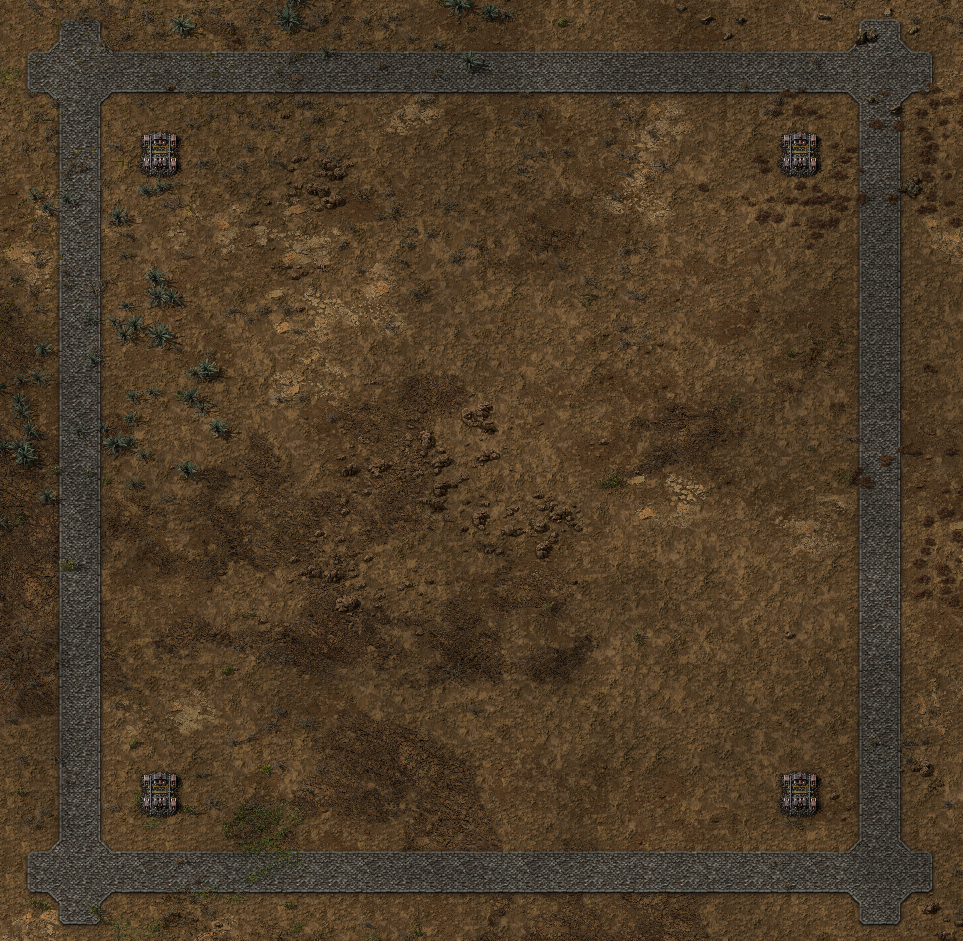

# Empty Block

Used as a starting point for all other Factorio Blue Prints.  Future placement of Roboports is at the crossroads.  Each block is intended to overlap on the stone bricks.

The rail tiles are only used for alignment to ensure that future rail-based modules will still align with earlier placed blocks.

```
0eNqd3N1O20AQBeB32WsjeRxPHPIqFUKBWmA1OFFiqiKUd28CFKHSHz6uEIhZZ3yye87O7NnHcrW+77e7YZzK8rEM15txX5ZfHst+uBlX69PfpodtX5ZlmPq7UpVxdXf6bT9txv7sajdcfyuHqgzj1/5HWcbhoir9OA3T0D8P8/TLw+V4f3fV747/8GaA3Wq4uZ3Ojj/Wx3G3m/0xajOenngc6aypq/Lw9PNwqN6N03x0nH8PM9OP8+dhWvw0p1GOL2oa1i9v6d3TFi+fen747Y1vV9NtOX2Ev4akhjQtR8AzOs+k80w6zqTjTOYvH2vhIZ2HzD3kE7m0HjLzkMZDwkNqDolzD3H0w9EPRz8c/XD0w9EPRz8c/XD0HXzH3qF35B14x/0Tk94h1AiGnJ/ASfB7YigYbf5C8XeWpwXPPJ/dvoT4OuWLoa+4vqw7dzhBOQs61Tqfu2hwZeLyxzWWCzlXiyJJ04VvuvBNF77pwjdd+KYL33Thmy5804VvuvBNF77pwjdd+KYL33Thmy5804VvuvBNF77JwjdZ+CYL32Thmyx8k4VvsvBNFr7JwjdV+KYK31Thmyp8U4VvqvBNFb6pwjdV+KYK32Thmyx8k4VvsvBNFr7JwjdZ+CYL32Thmyx8k4VvsvBNFr7JwjdZ+CYL32Thmyx8W5ekrUvSlt9Wy29r5pnMPJMZZzLjTBrPpPFMGs6k4UzCMwnPJDiT4Exqz6T2TGrOpNZM4pwzeQ3hp0AmvyLgGd5BDO8gBncQgzuI4R3E8A5icAcxuIMY3tsL7+0Fl52Cy07hxZrwYk2wjgjWEeEcH87xwRwfzPHhHB/O8cEcH8zx4RwfzvHBHB/M8eEcH87xwRwfzPHhHB/O8cEcH8zxTvHO8EzwzO9O787uTO7M7U7tzuxM7MzrTuvO6kzqzOlO6c7oTOjM507nzuZM5szlTuXO5Ezkvlf3baHvCnlTyMznxOe8x7SHWTB7M3crcytvMwyMgoKgGPB04Nmgk0HnAi9LvCrpoqRrEtMDs4OSg3ID0zSztJK0cjTLJVZLKpZUK7FsZdWqolU1K28fePegmwfdO/A2jndxuonTPZxvqX1HzRtq3k97icMrHFzg4PqGl5y84sQFJ643eQnQK4BcAOT6n5dkvSLLBVmux3qJ3CvkXCDn+ri3LLxjwQ0L7ld4C8k7SNxA4v6Rt/S8o8cNPe7neYvVO6zcYOX+qre8vePNDW/ud/sRBD+BwAcQ+PyBHwnxEyF8IITPg/gRHT+hwwd0+HzO6/mnBUd0HDHnCM+j5YgZRzQcERxRa8THzy2+RjDmwZgHYx6MeTDmwZgHYx6MeTDmDDkjzoAz3gw3o+0TnJHDAAVax9cE9A0pBIqxfon0W6rTQOcZz2ReLHg94iWPV1VeuJkbmH6Y4ZhEmadZCrDaYEHDmollGSs/EJdsdnWvq1td3enqRlf3ubrN1V2ubnJ1j6tbXN3h6gZX97e6vdXdrW5udW+rW1vZ2crGVva1sq2VXa1samVPK1ta2dGqhlb1s6qdVd2samZVL6taWdXJqkZW9bGyjZVdrGxiZQ8rW1jZwcoGVvavsn2V3atsXmXvKltX2bnKxlX2rbJtlV2rfoGg3x/IN9vwxTZ+baTfGsmXRv7nzsiL6vmO1OWbK1Wr8r3f7Z+GmC+6plnEed01h8NPzVbxiA==
```

